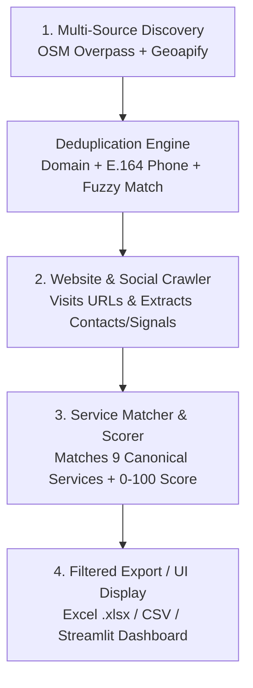

# Lead Scraper & Agency Qualification Engine

A high-performance B2B lead generation, website auditing, and sales qualification engine. Discovers business leads from OpenStreetMap (Overpass API) and Geoapify Places API, crawls their websites to extract verified contact details and technical performance metrics, matches them against 9 canonical digital agency services, calculates a 0–100 Opportunity Score, and exports outreach-ready spreadsheets to **Excel (`.xlsx`)** and **CSV**. Includes both a full **CLI** and an interactive **Streamlit Web Dashboard**.

---

## Web Dashboard (Interactive UI)

Launch the interactive browser UI to search, live-filter, inspect leads, and download Excel/CSV sheets directly from your browser:

```bash
# 1. Install dependencies
pip install -r requirements.txt

# 2. Start the web dashboard (opens automatically on http://localhost:8501)
streamlit run app.py
```

---

## Quick Start (For Managers & Sales Teams)

Generate an outreach-ready Excel lead sheet in **one simple command**:

```bash
# Run full pipeline for any city & industry (e.g. Toronto Real Estate -> Excel)
python main.py run --country CA --city Toronto --category "real estate" --count 25 --export-out data/toronto_real_estate.xlsx --export-format xlsx --contactable
```

*(This automatically discovers the businesses, crawls their websites for emails/phones/SEO defects, scores them, and creates your Excel spreadsheet).*

---

## Commands at a Glance

| Interface | Command / Usage | Purpose | Example |
|---|---|---|---|
| **Web UI** | `streamlit run app.py` | **Interactive Browser App**: Visual search, live filtering, and 1-click Excel/CSV downloads. | `streamlit run app.py` |
| **CLI** | `python main.py run` | **All-in-One Automation**: Scrapes, crawls websites, scores, and exports to Excel/CSV. | `python main.py run --country US --city Miami --category "dentist" --export-out data/miami_dentists.xlsx --export-format xlsx --contactable` |
| **CLI** | `python main.py scrape` | **Discovery Only**: Gathers raw business listings from maps and saves them into the database. | `python main.py scrape --country US --city "New York" --category "lawyer" --count 30` |
| **CLI** | `python main.py analyze` | **Website Crawling & Scoring**: Visits websites of saved leads to extract emails, phones, SEO issues & scores. | `python main.py analyze --city "New York" --category "lawyer"` |
| **CLI** | `python main.py export` | **Custom Excel/CSV Export**: Pulls custom filtered lists from the database. | `python main.py export --city Miami --category "dentist" --priority WARM --contactable --format xlsx --out data/ready.xlsx` |
| **CLI** | `python main.py info` | **Database Dashboard**: Shows total leads collected, email/phone percentages, and priority breakdown. | `python main.py info` |

---

## Supported Categories & Industries

You can scrape any of the following categories across the **United States (`US`)**, **Canada (`CA`)**, the **UK (`GB`)**, **Germany (`DE`)**, the **UAE (`AE`)**, and globally:

### 1. High-Value Service & Professional Niches (Best for SEO, Web Dev & AI Automation)
- **Real Estate & Property**: `"real estate"`, `"realtor"`, `"estate agent"`, `"property"`, `"real estate agency"`
- **Healthcare & Dental**: `"dentist"`, `"dental clinic"`, `"orthodontist"`, `"doctor"`, `"medical clinic"`, `"clinic"`, `"optician"`, `"pharmacy"`, `"veterinary"`
- **Legal & Financial**: `"lawyer"`, `"attorney"`, `"law firm"`, `"accountant"`, `"accounting"`
- **Personal Care & Wellness**: `"salon"`, `"hair salon"`, `"barber"`, `"spa"`, `"beauty salon"`
- **Fitness & Sports**: `"gym"`, `"fitness"`, `"fitness center"`
- **Automotive & Local Services**: `"car repair"`, `"auto repair"`, `"mechanic"`, `"car wash"`, `"laundry"`, `"dry cleaning"`

### 2. Retail, E-Commerce & Hospitality (Best for Google Shopping & Social Media)
- **Fashion & Retail**: `"clothing store"`, `"boutique"`, `"apparel"`, `"fashion"`, `"shoe store"`, `"jewelry"`, `"electronics"`, `"furniture"`, `"bookstore"`, `"gift shop"`
- **Food & Dining**: `"restaurant"`, `"cafe"`, `"coffee shop"`, `"bakery"`, `"pizzeria"`, `"bar"`, `"pub"`
- **Hospitality & Lodging**: `"hotel"`, `"motel"`, `"hostel"`

---

## Target Markets (US & Canada Focus)

| Country | Code | Major Target Cities | Example Command |
|---|---|---|---|
| **United States** | **`US`** | `New York`, `Los Angeles`, `Chicago`, `Houston`, `Miami`, `Dallas`, `Atlanta`, `Seattle`, `Austin`, `Denver` | `python main.py run --country US --city Miami --category "real estate" --count 25 --export-out data/miami_re.xlsx --export-format xlsx --contactable` |
| **Canada** | **`CA`** | `Toronto`, `Vancouver`, `Montreal`, `Calgary`, `Ottawa`, `Edmonton`, `Mississauga`, `Winnipeg` | `python main.py run --country CA --city Toronto --category "dentist" --count 25 --export-out data/toronto_dentists.xlsx --export-format xlsx --contactable` |
| **United Kingdom**| **`GB`** | `London`, `Manchester`, `Birmingham`, `Leeds`, `Glasgow` | `python main.py run --country GB --city London --category "clothing store" --count 25 --export-out data/london_shops.xlsx --export-format xlsx` |
| **Germany** | **`DE`** | `Berlin`, `Munich`, `Hamburg`, `Frankfurt`, `Cologne` | `python main.py run --country DE --city Berlin --category "dentist" --count 25 --export-out data/berlin_dentists.xlsx --export-format xlsx` |
| **United Arab Emirates** | **`AE`** | `Dubai`, `Abu Dhabi`, `Sharjah` | `python main.py run --country AE --city Dubai --category "real estate" --count 25 --export-out data/dubai_re.xlsx --export-format xlsx` |

---

## How the Pipeline Works



### 1. Discovery (`scrape`)
- Queries OpenStreetMap and Geoapify Places in parallel.
- Automatically removes duplicate listings using domain normalization, international E.164 phone formatting, and RapidFuzz name+address matching ($\ge 90\%$).

### 2. Website Crawling & Intelligence (`analyze`)
- **Direct Emails**: Extracts authentic emails from `mailto:` links and page text (strictly filtering out asset files like `image@2x.png` and tracking artifacts like Sentry/Wix tokens).
- **Direct Phone Numbers**: Discovers and standardizes telephone numbers.
- **Social Media**: Finds official Facebook, Instagram, and LinkedIn profile URLs.
- **Technical & Performance Signals**: Measures **HTTP Response Time (`ms`)**, **Page Size (`KB`)**, SSL/HTTPS security, Mobile Viewport responsiveness, Title, Meta description, and H1 heading structure.
- **E-Commerce & Booking Detection**: Detects shopping carts/checkout engines and online appointment booking widgets (Calendly, WhatsApp, booking forms).

### 3. Service Matching & Opportunity Scoring (`scoring`)
Matches each lead against the **9 Canonical Agency Services**:
1. `Web Development` (businesses with no website or broken sites)
2. `Web App Development` (custom portals, checkout flows, and e-commerce stores)
3. `Mobile App Development` (high-traffic booking & retail businesses)
4. `SEO` (missing titles, meta descriptions, multiple H1s, or low search presence)
5. `Social Media Marketing` (businesses lacking Facebook, Instagram, or LinkedIn)
6. `Social Media Management` (businesses needing active social optimization)
7. `Google Ads` (high commercial intent niches lacking paid visibility)
8. `Google Shopping` (e-commerce storefronts selling physical goods)
9. `AI Automation` (appointment-based businesses lacking automated booking widgets or chatbots)

### 4. Opportunity Score & Priority Tiers

Every lead is assigned a score from **0 to 100**:

| Priority | Score Range | What It Means for Sales Outreach |
|---|---|---|
| **`HOT`** | **60 – 100** | **Highest Need / Prime Pitch**: Major digital gaps (e.g. no website at all, no social media, critical technical defects). |
| **`WARM`** | **30 – 59** | **Moderate Need / Specific Gaps**: Established business with a website, but lacking appointment booking widgets, having SEO issues, or missing ads. |
| **`COLD`** | **0 – 29** | **Well-Optimized**: Modern, fast HTTPS website with complete social media and active booking forms. |

---

## What Does `--contactable` Mean?

In any command or filter, selecting **`contactable`** means:
> **"Only include businesses where a verified Phone Number or Email Address was found."**

- **`contactable = True`** (`actionable`): Has a direct phone number or email address $\rightarrow$ ready for immediate calling or emailing.
- **`contactable = False`** (`needs_manual_lookup`): High opportunity, but contact info is missing on public listings and requires manual research.

---

## Detailed CLI Command Guide

### 1. `run` — End-to-End Automation
```bash
# 1. Standard run: Scrape, crawl, score, and export to Excel (Actionable only)
python main.py run --country US --city Miami --category "real estate" --count 25 --export-out data/miami_real_estate.xlsx --export-format xlsx --contactable

# 2. Run with score filter: Only export leads with score >= 40
python main.py run --country CA --city Toronto --category "dentist" --count 25 --export-out data/toronto_dentists.xlsx --export-format xlsx --min-score 40

# 3. Database-only run: Do everything but skip file export (save directly into database)
python main.py run --country US --city "New York" --category "lawyer" --count 20 --no-export
```

### 2. `export` — Multi-Criteria Excel & CSV Export
Queries the database using combined `AND` logic:
```bash
# 1. Export all ready-to-call Berlin dentists to Excel
python main.py export --city Berlin --category "dentist" --contactable --format xlsx --out data/berlin_warm_dentists.xlsx

# 2. Export leads needing "SEO" services with score >= 40 to CSV
python main.py export --service "SEO" --min-score 40 --contactable --format csv --out data/seo_leads.csv

# 3. Export businesses with NO website (Prime targets for Web Development)
python main.py export --no-website --service "Web Development" --format csv --out data/no_website_leads.csv

# 4. Export leads that have verified email addresses
python main.py export --has-email --format xlsx --out data/email_leads.xlsx

# 5. Export HOT priority leads
python main.py export --priority HOT --format xlsx --out data/hot_leads.xlsx
```

#### Available Export Filter Options:
| Option Flag | Short | What It Filters | Example |
|---|---|---|---|
| `--out` | `-o` | Output file destination | `--out data/leads.xlsx` |
| `--format` | `-f` | Format (`xlsx` or `csv`) | `--format xlsx` |
| `--category` / `--industry` | `-k` | Industry / niche | `--category "dentist"` |
| `--city` | `-c` | City name (case-insensitive) | `--city Toronto` |
| `--country` | `-C` | Country code or name | `--country CA` |
| `--priority` | `-p` | Priority tier (`HOT`, `WARM`, `COLD`) | `--priority WARM` |
| `--service` | `-s` | One of the 9 canonical services | `--service "Google Ads"` |
| `--min-score` | `-m` | Minimum opportunity score (0–100) | `--min-score 40` |
| `--contactable` | | Only leads with phone or email | `--contactable` |
| `--needs-manual-lookup` | | Only leads needing manual phone search | `--needs-manual-lookup` |
| `--has-email` | | Only leads with an email address | `--has-email` |
| `--has-phone` | | Only leads with a phone number | `--has-phone` |
| `--no-website` | | Only businesses without a website | `--no-website` |
| `--source` | | Filter by source (`osm`, `geoapify`) | `--source geoapify` |

### 3. `info` — Database Health & Stats
Displays total leads in database, contact fill rates, and priority distribution:
```bash
python main.py info
```

---

## Automated Testing

The project includes an automated test suite with **100% database & network isolation** (runs against an in-memory SQLite sandbox):

```bash
pytest tests/ -v
```
*(All 78 unit & integration tests pass with zero external network calls and zero production database touches).*

---

## Project Architecture

```
Lead Scraper Automation/
├── analyzer/
│   └── crawler.py               # Web crawler, email/phone extractor, SEO & performance analyzer
├── config/
│   └── settings.py              # Configuration, rate limits, category mappings, logging
├── data/
│   ├── leads.db                 # Local SQLite database (persisted business leads)
│   └── sample_export.csv        # Realistic deliverable sample export
├── db/
│   ├── crud.py                  # Database CRUD helper queries
│   ├── models.py                # SQLAlchemy models (Lead and ScrapeLog)
│   └── session.py               # Database engine & session context manager
├── export/
│   └── exporter.py              # Multi-filter CSV and XLSX export engine
├── matcher/
│   └── service_matcher.py       # 9 canonical agency service qualification rules
├── pipeline/
│   ├── analyzer_orchestrator.py # Batch crawler and scoring orchestrator
│   ├── coverage_reporter.py     # Real-time fill rate & data quality metrics
│   ├── discovery_merger.py      # Cross-provider deduplication & metadata merger
│   └── orchestrator.py          # Multi-source discovery orchestrator (OSM + Geoapify)
├── resolver/
│   └── web_presence_resolver.py # Social tag standardizer & contactable manager
├── scoring/
│   └── lead_scorer.py           # 0-100 opportunity scoring & reason generator
├── scraper/
│   ├── base_provider.py         # Abstract DiscoveryProvider base class
│   ├── dedup.py                 # E.164 phone, domain, and RapidFuzz deduplication engine
│   ├── geoapify_provider.py     # Geoapify Places discovery client
│   └── osm_provider.py          # OSM Overpass client with Nominatim geocoding
├── tests/                       # Automated test suite (78 tests in in-memory SQLite sandbox)
├── logs/
│   └── app.log                  # Consolidated rotating application log
├── .env.example                 # Example configuration template
├── requirements.txt             # Python dependencies
├── app.py                       # Streamlit web dashboard
└── main.py                      # CLI entrypoint (run, scrape, analyze, export, info)
```
